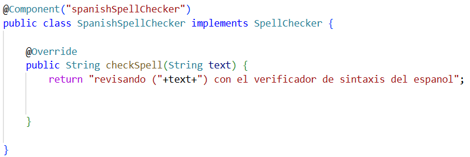

## Escuela Colombiana de Ingeniería

## Arquitecturas de Software

## Emily Noreña y Haider Rodriguez

# Componentes y conectores - Parte I.

El ejercicio se debe traer terminado para el siguiente laboratorio (Parte II).

#### Middleware- gestión de planos.

## Antes de hacer este ejercicio, realice [el ejercicio introductorio al manejo de Spring y la configuración basada en anotaciones](/Introduccion).

En este ejercicio se va a construír un modelo de clases para la capa lógica de una aplicación que permita gestionar planos arquitectónicos de una prestigiosa compañia de diseño. 

**Solución: Ejercicio introductorio al manejo de Spring y la configuración basada en anotaciones**

En las clases `SpanishSpellChecker` y `EnglishSpellChecker` incluimos la anotación `@Component("<nombre_del_bean>")`. Esta anotación nos permite marcar estas clases como un bean administrado por Spring. Una vez detectada, se registra en el contenedor de Spring para poder inyectarla. El valor dentro de la anotación corresponde a el nombre del bean, sirve para distinguir beans del mismo tipo.

   

   

En la clase `GrammarChecker`, añadimos la anotación `@Component`, `@Autowired` y `@Qualifier("englishSpellChecker")`. 

`@Autowired`: Le dice a Spring que debe inyectar automáticamente, en este caso SpellChecker. Aquí se puede presentar un conflicto de dependencias. Para esto, usamos `@Qualifier("<nombre_del_bean>")`. Esta anotación resuelve ese conflicto cuando hay múltiples implementaciones del mismo tipo.

   

Salidas:

   

   

# Blueprints - Parte II.

1. Configure la aplicación para que funcione bajo un esquema de inyección de dependencias, tal como se muestra en el diagrama anterior.

	Lo anterior requiere:

	* Agregar las dependencias de Spring.

	**Rta:** Agregamos las dependencias necesarias al pom
   
		<dependencies>
			<dependency>
				<groupId>org.springframework</groupId>
				<artifactId>spring-core</artifactId>
				<version>4.2.4.RELEASE</version>
			</dependency>
			<dependency>
				<groupId>org.springframework</groupId>
				<artifactId>spring-context</artifactId>
				<version>4.2.4.RELEASE</version>
			</dependency>
			<dependency>
				<groupId>junit</groupId>
				<artifactId>junit</artifactId>
				<version>4.12</version>
			</dependency>
		</dependencies>

	* Agregar la configuración de Spring.

	* Configurar la aplicación -mediante anotaciones- para que el esquema de persistencia sea inyectado al momento de ser creado el bean 'BlueprintServices'.

	**Rta:** Configuración de la aplicación: Acá se define la clase de configuración para cargar los beans.

 

2. Complete los operaciones getBluePrint() y getBlueprintsByAuthor(). Implemente todo lo requerido de las capas inferiores (por ahora, el esquema de persistencia disponible 'InMemoryBlueprintPersistence') agregando las pruebas correspondientes en 'InMemoryPersistenceTest'.

**Rta:** 

 

 

Pruebas que se implementaron:

- `saveNewAndLoadTest`: Verifica que un blueprint guardado pueda recuperarse correctamente y sea el mismo objeto.
- `saveExistingBpTest`: Comprueba que no se puedan guardar dos blueprints con el mismo autor y nombre (lanza excepción).
- `testSaveAndGetBlueprint`: Asegura que al guardar un blueprint, luego se pueda recuperar con sus datos intactos.
- `testGetBlueprintsByAuthor`: Valida que se recuperen todos los blueprints de un autor específico.
- `testGetAllBlueprints`: Garantiza que se puedan obtener todos los blueprints almacenados en memoria.

3. Haga un programa en el que cree (mediante Spring) una instancia de BlueprintServices, y rectifique la funcionalidad del mismo: registrar planos, consultar planos, registrar planos específicos, etc.

 

 

4. Se quiere que las operaciones de consulta de planos realicen un proceso de filtrado, antes de retornar los planos consultados. Dichos filtros lo que buscan es reducir el tamaño de los planos, removiendo datos redundantes o simplemente submuestrando, antes de retornarlos. Ajuste la aplicación (agregando las abstracciones e implementaciones que considere) para que a la clase BlueprintServices se le inyecte uno de dos posibles 'filtros' (o eventuales futuros filtros). No se contempla el uso de más de uno a la vez:
	* (A) Filtrado de redundancias: suprime del plano los puntos consecutivos que sean repetidos.
	* (B) Filtrado de submuestreo: suprime 1 de cada 2 puntos del plano, de manera intercalada.

5. Agrege las pruebas correspondientes a cada uno de estos filtros, y pruebe su funcionamiento en el programa de prueba, comprobando que sólo cambiando la posición de las anotaciones -sin cambiar nada más-, el programa retorne los planos filtrados de la manera (A) o de la manera (B). 
